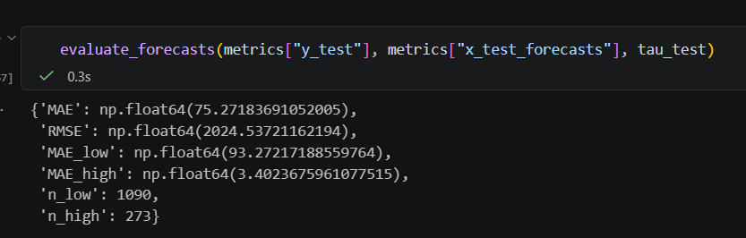
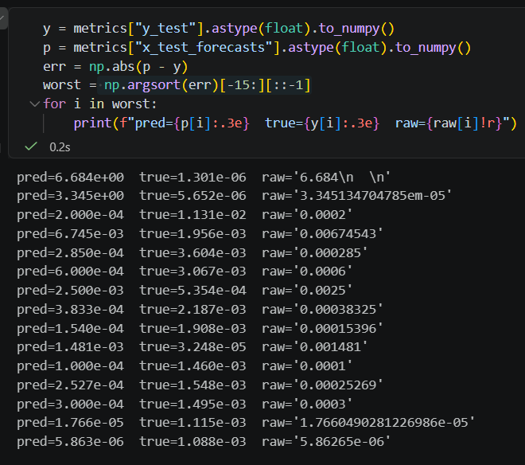

**`19 Aug 2026`**

I've completed implementation of the paper. The evaluation results on random selection
are overwhelmingly bad. 

It turns out that the reason is because the model generates and forecasts garbage values. 

Must figure out a way to make model emit the right forecasts. 

Need to regenerate the initial preds and refinement loop preds without garbage values. 

**PLAN**: Scale the values before generating preds with 1e4. 

